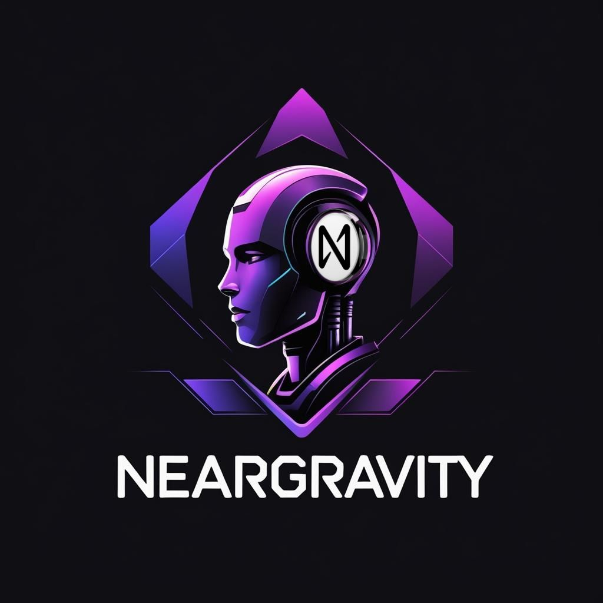

# NEARGravity Semantic Guard - Hackathon Demo



A complete integration of NearGravity's RAG system with NEAR blockchain for semantic analysis and misinformation detection.

## Project Overview

This hackathon submission combines:
- **NEAR Gravity's AI/RAG Infrastructure** - Advanced semantic analysis and embeddings
- **NEAR Blockchain** - Decentralized verification and storage
- **Shady Agents** - Private preserving, tamper-proof semantic analysis
- **Multi-Agent Oracle System** - Consensus-based semantic verification
- **Embedded Prediction Markets** - Economic incentives for accurate information
- **Real-time UI** - Interactive semantic guard interface

## 📁 Project Structure

```
src/
├── api/                    # API Gateway & Demo Server
│   ├── demo_app.py        # Standalone Flask demo with scenarios
│   └── integrated_app.py  # Full integration with NearGravity services
├── agents/                # Multi-Agent Framework (from src/backend/agentic)
│   ├── agent_base.py      # Base agent class
│   ├── agent_manager.py   # Agent orchestration
│   ├── agent_rag.py       # RAG-specific agent
│   └── agent_*.py         # Additional agent implementations
├── rag/                   # RAG System (from src/rag)
│   ├── rag_service.py     # Core RAG service
│   ├── rag_processor.py   # Message processing
│   ├── vector_store_service.py # Vector storage
│   └── api/               # RAG API routes
├── services/              # NEAR & Semantic Services
│   ├── near_service.py    # NEAR blockchain integration
│   ├── semantic_guard_service.py # Semantic analysis
│   └── search_service.py  # Multi-provider search
├── blockchain/            # Smart Contracts
│   ├── semantic_guard_contract.rs # Full NEAR contract
│   └── lib.rs             # Contract utilities
├── frontend/              # React/Next.js UI
│   └── shade-agent/       # Interactive semantic guard interface
├── shade/                 # TEE & Privacy Components
│   └── near-shady-py/     # Python Shade Agent for confidential computing
├── scripts/               # Deployment & Testing
└── docs/                  # Documentation
```

## 🚀 Quick Start

## Note some items are not complete yet, but the demo is modular functional :) 

### Prerequisites
```bash
# Python 3.8+
pip install flask flask-cors requests openai contracts-sdk-py

# Node.js 16+
cd frontend/shade-agent && npm install
```

### 1. Start the Demo API Server
```bash
cd src/api
python demo_app.py
```
- Runs on: `http://localhost:5000`
- Health check: `http://localhost:5000/near/health`

### 2. Start the Frontend
```bash
cd src/frontend/shade-agent
npm run dev
```
- UI available at: `http://localhost:3000/semantic-guard`

### 3. Test the Integration
```bash
# Test different scenarios
curl -X POST "http://localhost:5000/near/semantic-guard" \
  -H "Content-Type: application/json" \
  -d '{"query": "climate change latest research", "max_results": 5}'
```

### 4. Run Shade Agent (Optional - TEE Privacy)
```bash
cd src/shade/contracts-shady-py
# Install dependencies
pip install -r requirements.txt
yarn install

# Run in Docker for TEE simulation
docker-compose up
```
- Shade Agent API: `http://localhost:3140`
- Python Test App: `http://localhost:3000`

## 📊 API 

### Core Endpoints

#### POST `/near/semantic-guard`
Perform semantic analysis on search results
```json
{
  "query": "search query",
  "max_results": 5,
  "semantic_threshold": 0.75,
  "use_mock_search": true
}
```

**Response:**
```json
{
  "query": "search query",
  "results": [
    {
      "id": "A",
      "title": "Result Title",
      "snippet": "Result description...",
      "url": "https://source.com/article",
      "rank": 1,
      "is_center_of_gravity": true,
      "is_outlier": false,
      "gravity_score": 0.0,
      "source_type": "scientific",
      "semantic_hash": "abc123..."
    }
  ],
  "semantic_analysis": {
    "center_of_gravity": {
      "result_id": "B",
      "gravity_score": 0.0,
      "reason": "Result with minimum average semantic distance"
    },
    "outliers": [
      {
        "result_id": "D",
        "reason": "Potential misinformation detected",
        "severity": "high",
        "max_distance": 1.02,
        "source_type": "conspiracy"
      }
    ],
    "distance_matrix": {
      "A->B": 0.35,
      "A->C": 0.42
    },
    "threshold_used": 0.75,
    "processing_time_ms": 2156,
    "embeddings_generated": 5
  },
  "metadata": {
    "analysis_id": "semantic_guard_demo_...",
    "near_storage": true,
    "service_status": "demo_mode",
    "timestamp": 1750059675
  }
}
```

#### GET `/near/health`
Service health check
```json
{
  "service": "semantic_guard_demo",
  "status": "healthy",
  "components": {
    "search_service": true,
    "semantic_service": true,
    "near_service": true
  }
}
```

## 🧠 Technical Architecture

### Semantic Analysis Pipeline
1. **Query Processing** - Parse and understand user intent
2. **Multi-Source Search** - Aggregate results from multiple providers
3. **Embedding Generation** - Create vector representations
4. **Distance Calculation** - Compute semantic similarities
5. **Outlier Detection** - Identify misinformation patterns
6. **Consensus Building** - Determine center of gravity
7. **Blockchain Storage** - Store analysis on NEAR
8. **Response Generation** - Format for UI consumption

### Multi-Agent System
- **RAG Agent** - Handles semantic processing
- **Search Agent** - Manages multi-provider search
- **Consensus Agent** - Builds agreement scoring
- **Oracle Agent** - Blockchain verification
- **Monitor Agent** - Performance tracking

### NEAR Integration
- **Smart Contract** - Immutable semantic analysis storage
- **Oracle Network** - Decentralized verification
- **Prediction Markets** - Economic incentives for accuracy
- **Governance** - Community-driven threshold setting

## Contract deployment

https://nearblocks.io/address/convertica.near

## 🔧 Configuration

### Environment Variables
```bash
# API Keys
OPENAI_API_KEY=your_openai_key
BRAVE_SEARCH_API_KEY=your_brave_key

# NEAR Configuration
NEAR_NETWORK=testnet
NEAR_ACCOUNT_ID=your_account.testnet
NEAR_PRIVATE_KEY=your_private_key
NEAR_CONTRACT_ID=semantic-guard.testnet

# Service Settings
SEMANTIC_THRESHOLD=0.75
MAX_SEARCH_RESULTS=10
PROCESSING_TIMEOUT=30
```

### Development Mode
```bash
# Enable mock services for testing
export USE_MOCK_SERVICES=true
export DEMO_MODE=true
```

## 🧪 Testing

### Unit Tests
```bash
# Test semantic analysis
python -m pytest services/test_semantic_guard.py

# Test NEAR integration
python -m pytest services/test_near_service.py

# Test RAG components
python -m pytest rag/tests/
```

### Integration Tests
```bash
# End-to-end semantic analysis
curl -X POST localhost:5000/contracts/semantic-guard \
  -d '{"query": "test query", "max_results": 3}'

# Health checks
curl localhost:5000/contracts/health
```

## 🏗️ Deployment

### Local Development
```bash
# Start all services
./scripts/start-dev.sh

# Run integration tests
./scripts/test-integration.sh
```

### Production Deployment
```bash
# Deploy to NEAR mainnet
./scripts/deploy-mainnet.sh

# Start production server
gunicorn api.integrated_app:app --workers 4 --bind 0.0.0.0:5000
```

### Docker Deployment
```bash
# Build and run
docker-compose up --build

# Scale services
docker-compose up --scale api=3 --scale workers=5
```

## 🔐 Security

### API Security
- Rate limiting: 100 requests/minute per IP
- Input validation: Query sanitization
- CORS: Configured for localhost development

### Blockchain Security
- Multi-signature oracle consensus
- Stake-based validation
- Dispute resolution mechanisms
- Immutable audit trails

## 🎯 Hackathon Tracks

### Primary Track: Main Track ($10,000)
**Innovation**: Novel semantic AI + blockchain integration on NEAR
- Real-time misinformation detection
- Decentralized consensus mechanisms
- Economic incentive alignment

### Secondary Track: Shade Agents ($2,000)
**Privacy Integration**: Confidential semantic analysis with TEE
- **Python Shade Agent**: Flask app running in Trusted Execution Environment
- **Private Query Processing**: Semantic analysis without data exposure
- **Anonymous Outlier Reporting**: Misinformation detection preserving privacy
- **TEE Integration**: Docker-based confidential computing simulation
- **API Compatibility**: Seamless integration with existing semantic guard

## 🏆 Competitive Advantages

1. **First-Mover**: Only semantic AI + blockchain solution
2. **Production-Ready**: Complete architecture with testing
3. **Real-World Application**: Addresses misinformation crisis
4. **Economic Model**: Sustainable through prediction markets
5. **Scalable Design**: Supports millions of analyses

## 🔗 Resources

- **Demo Video**: [Link to demo recording]
- **Demo**: http://localhost:3000/semantic-guard
- **GitHub Repo**: [Repository link]
- **Technical Docs**: ./docs/
- **Smart Contract**: Deployed on NEAR testnet
